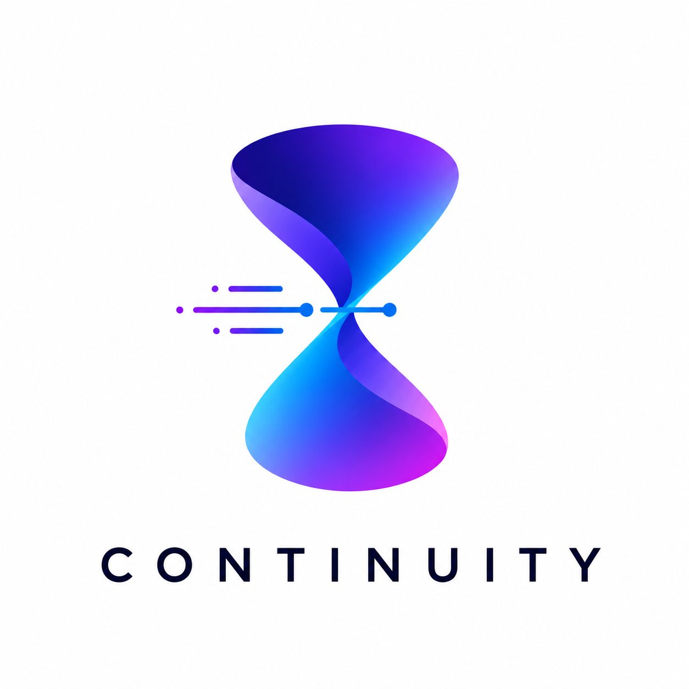

<div align="center">



# Continuity

**An AI project runtime. Never lose AI project context again.**

[](#whats-on-disk)
[](#why-its-different)
[](package.json)
[](#license)

</div>

---

Continuity is the persistent brain **above** your AI tools. When one session
stops, expires, loses context, or hits a limit, Continuity has already saved the
state, generated the next task, and written a perfect handoff — so the same AI
later, or a different one, continues without losing momentum.

```
Goal → Plan → Task Queue → Agent Executes → Checkpoint
     → Review → Memory Update → Next Task → Handoff / Resume → Repeat
```

> Continuity does **not** replace Claude, GPT, Cursor, or Gemini. Those are
> temporary workers. Continuity owns the memory, the task graph, the decisions,
> the checkpoints, and the handoffs.

## Why it's different

| | |
|---|---|
| 🗂️ **Local-first** | Everything lives in plain files under `.continuity/`. No database, no account, no network. Your project, your disk. |
| 📌 **Files-as-truth** | The markdown in `memory/` is the source of record. The `knowledge/` store is a *derived, rebuildable* index — delete it, run `recall --rebuild`, it's back. You never lose real data. |
| ⚡ **No LLM required** | Planning, review, and search are heuristic and instant. The model adapter is a future seam, not a dependency — Continuity works offline and free. |
| 🤝 **Handoffs that work cold** | Claude/Cursor get *"read these files."* GPT/Gemini get the state *inlined.* Same facts, framed for each agent. |

## Install

```bash
git clone https://github.com/Noctilucenty/Continuity.git
cd Continuity
npm install
npm run build
npm link            # makes `continuity` available globally
```

Prefer not to link? Run any command with `node dist/cli.js <command>`.

## Quick start

```bash
cd your-project
continuity init
continuity plan "Build the trader dashboard with live odds"
continuity next                       # start the highest-leverage task

# ...do the work with your AI...

continuity checkpoint --summary "Wired the odds feed" \
  --changed "Added poller" --failed "WS reconnect drops" \
  --decision "Poll every 5s instead of WebSocket for v1"

continuity handoff --to gpt           # paste-ready briefing for the next agent
continuity resume --raw | pbcopy      # the exact prompt to restart, copied
```

## Commands

| Command | What it does |
|---------|--------------|
| `continuity init` | Scaffold `.continuity/` in the current directory |
| `continuity status` | Dashboard: tasks, knowledge, last checkpoint |
| `continuity plan [goal]` | Turn your goal + memory into a scored task list |
| `continuity next` | Start the single highest-leverage task |
| `continuity checkpoint` | Save what changed; capture knowledge; refresh handoffs |
| `continuity summarize` | Compact digest of the whole project |
| `continuity review` | Audit risk / tests / docs / next best move (`--apply` to enqueue) |
| `continuity decide` | Record a decision in the journal (`--over` adds a graph edge) |
| `continuity recall "<query>"` | Search memory and decisions (`--rebuild` to reindex) |
| `continuity graph` | Render the knowledge graph (`--json` for tooling) |
| `continuity handoff --to <agent>` | Briefing for `claude` · `gpt` · `cursor` · `gemini` · `generic` |
| `continuity resume` | Print the best prompt to restart work now (`--raw` to pipe) |

Every command that prompts interactively is also fully scriptable via flags, so
Continuity drops cleanly into automation and CI.

## What's on disk

```
.continuity/
  memory/        vision · architecture · current_state · decisions · bugs · next_actions · risks
  tasks/         task_queue.json · completed_tasks.json
  sessions/      session_log.md · checkpoints/
  handoffs/      claude · gpt · cursor · gemini · generic .md
  knowledge/     entries · entities · relations · index .json   ← the v0.2 store
  config.json
CONTINUITY.md
```

## The knowledge store

`continuity decide`, `recall`, and `graph` sit on a small typed store beside the
markdown. Decisions, bugs, lessons, and assumptions become queryable entries with
a keyword index; explicit relations (`chose_over`, `depends_on`, …) form a graph.

```bash
$ continuity decide --title "Use Polymarket API for odds" \
    --reason "Deeper liquidity and free real-time data" --over "Kalshi API"

$ continuity recall "polymarket liquidity"
  [decision] Use Polymarket API for odds  ·8
     Deeper liquidity and free real-time data

$ continuity graph
  Use Polymarket API for odds (decision)
    └─ chosen over → Kalshi API
```

Ask *"why did we choose Polymarket over Kalshi?"* and `recall` answers instantly —
offline, from your own recorded history.

## Roadmap

Built so the local-first core never breaks; every future piece is an additive seam.

- **Now** — decision journal, recall, knowledge graph, context compression.
- **Next** — Gemini handoff tuning, self-improving metrics, entity auto-linking.
- **Then** — model adapters → autonomous `continuity run` loop → multi-agent
  orchestration (Planner / Builder / Reviewer / Research / Memory).

Full detail in [`docs/ROADMAP.md`](docs/ROADMAP.md).

## License

MIT
