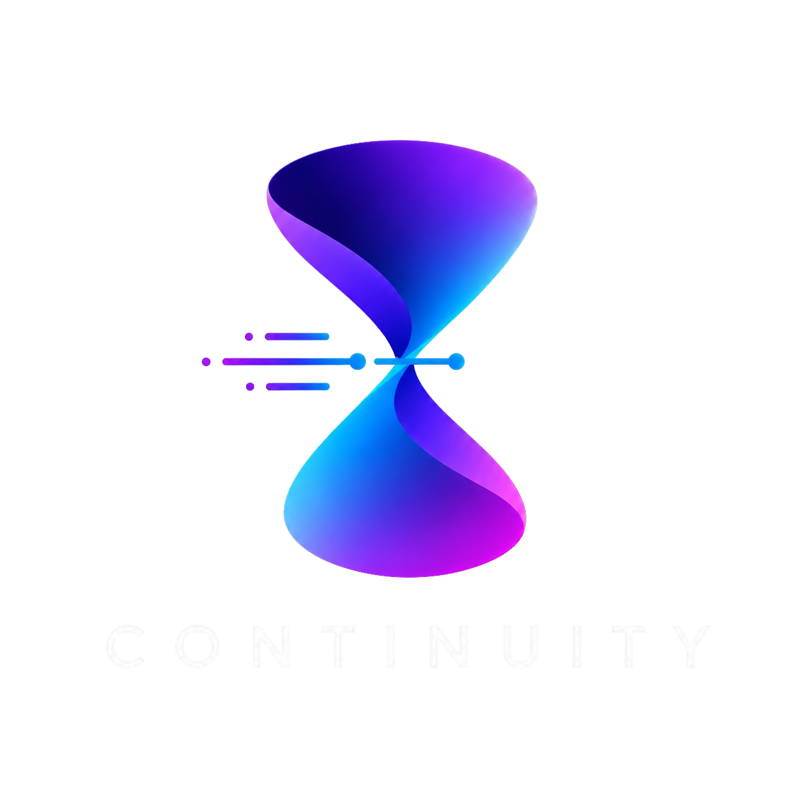

<div align="center">



### WORK · PERSIST · EVOLVE

**The persistent layer for AI-powered work.**

**NO CONTEXT LOST. ONLY MOMENTUM.**

[](https://github.com/Noctilucenty/Continuity/actions/workflows/ci.yml)
[](#use-it-anywhere)
[](#use-it-anywhere)
[](#why-its-different)

</div>

---

Continuity is the persistent brain **above** your AI tools. When one session
stops, expires, loses context, or hits a limit, Continuity has already captured
your project intelligence, created a seamless checkpoint, and written a perfect
handoff — so **any AI or person can resume work instantly.**

```
Goal -> Plan -> Task Queue -> Agent Executes -> Checkpoint
     -> Review -> Memory Update -> Next Task -> Handoff / Resume -> Repeat
```

> Continuity does **not** replace Claude, GPT, Cursor, or Gemini. Those are
> temporary workers. Continuity owns the memory, the task graph, the decisions,
> the checkpoints, and the handoffs.

---

## What it represents

The hourglass isn't decoration — it's the model. Work flows down through a single
point that loses nothing, then expands again on the other side.

| | |
|---|---|
| **Past work** | All your context, decisions, and progress are saved. |
| **Continuity** | We preserve and connect everything that matters. |
| **Future work** | Pick up anywhere. Keep moving forward without losing context. |

**Core idea** — Continuity captures your project intelligence, creates seamless
checkpoints, and lets any AI or person resume work instantly.

---

## Features

| | | |
|---|---|---|
| **Memory** | Everything about your project, organized and easy to recall. | `recall` · `decide` |
| **Checkpoints** | Automatic snapshots of progress, decisions, and project state. | `checkpoint` |
| **Handoffs** | Perfect briefings for any AI model or teammate. Continue instantly. | `handoff` · `resume` |
| **Sync** *(roadmap)* | Keep your work in sync across devices, teams, and environments. | — |
| **Built for developers** | A CLI that fits your workflow, not the other way around. | all commands |

> **Honest status:** Memory, Checkpoints, and Handoffs ship today and are
> local-first. Sync and team features are on the [roadmap](docs/ROADMAP.md), not
> yet built — Continuity is currently a single-machine CLI.

---

## Why it's different

| | |
|---|---|
| **Local-first** | Everything lives in plain files under `.continuity/`. No database, no account, no network. |
| **Files-as-truth** | Markdown in `memory/` is the source of record. `knowledge/` is a *derived, rebuildable* index — delete it, run `recall --rebuild`, it's back. |
| **No LLM required** | Planning, review, and search are heuristic and instant. The model adapter is a future seam, not a dependency. Works offline and free. |
| **Handoffs that work cold** | Claude/Cursor get *"read these files."* GPT/Gemini get the state *inlined.* Same facts, framed for each agent. |

---

## Use it anywhere

| | |
|---|---|
| **Local first** | Your project, your disk. Nothing leaves the machine. |
| **Private & secure** | Plain files you own. No account, no telemetry. |
| **Sync anywhere** *(roadmap)* | Carry context across devices and environments. |
| **Team ready** *(roadmap)* | Shared project memory for multiple humans and agents. |

---

## See it in action

```console
$ continuity status

  Continuity · Scenara

  Tasks           24 active
  Checkpoints     18 saved
  Next            Build liquidity engine
  Last sync       2m ago

  Next task
  Implement liquidity engine core module

  Context summary
  - Architecture decided
  - Polymarket API integrated
  - Auth flow completed
  - 2 known bugs
```

---

## Install

```bash
git clone https://github.com/Noctilucenty/Continuity.git
cd Continuity
npm install
npm run build
npm link            # makes `continuity` available globally
```

Prefer not to link? Run any command with `node dist/cli.js <command>`.

## Quick start

```bash
cd your-project
continuity init                       # start building with Continuity
continuity plan "Build the trader dashboard with live odds"
continuity next                       # start the highest-leverage task

# ...do the work with your AI...

continuity checkpoint --summary "Wired the odds feed" \
  --changed "Added poller" --failed "WS reconnect drops" \
  --decision "Poll every 5s instead of WebSocket for v1"

continuity handoff --to gpt           # paste-ready briefing for the next agent
continuity resume --raw | pbcopy      # the exact prompt to restart, copied
```

## Commands

| Command | What it does |
|---------|--------------|
| `continuity init` | Scaffold `.continuity/` in the current directory |
| `continuity status` | Dashboard: tasks, knowledge, last checkpoint |
| `continuity plan [goal]` | Turn your goal + memory into a scored task list |
| `continuity next` | Start the single highest-leverage task |
| `continuity done [taskId]` | Mark a task complete (defaults to the current one) |
| `continuity checkpoint` | Save what changed; capture knowledge; refresh handoffs. `--from-git` / `--since <ref>` derive it from git |
| `continuity summarize` | Compact digest of the whole project |
| `continuity review` | Audit risk / tests / docs / next best move (`--apply` to enqueue) |
| `continuity decide` | Record a decision (`--context`, `--file`, `--tag`, `--over`, `--supersedes`) |
| `continuity decisions` | Browse the decision journal (`--tag`, `--active`, `--search`) |
| `continuity recall "<query>"` | Search memory and decisions (`--rebuild` to reindex) |
| `continuity ask "<question>"` | Answer a question from stored memory (local, deterministic) |
| `continuity graph` | Render the knowledge graph (`--json` for tooling) |
| `continuity pack <topic>` | Generate a focused context bundle for one area (`--save`) |
| `continuity analyze` | Inspect the repository for local project intelligence (`--json`) |
| `continuity metrics` | Show usage signal and task-completion velocity (`--json`) |
| `continuity handoff --to <agent>` | Model-specific briefing for `claude` · `gpt` · `cursor` · `gemini` · `generic` |
| `continuity resume` | Print the best prompt to restart work now (`--raw` to pipe) |

Every interactive command is also fully scriptable via flags, so Continuity drops
cleanly into automation and CI.

## What's on disk

```
.continuity/
  memory/        vision · architecture · current_state · decisions · bugs · next_actions · risks
  tasks/         task_queue.json · completed_tasks.json
  sessions/      session_log.md · checkpoints/
  handoffs/      claude · gpt · cursor · gemini · generic .md
  knowledge/     entries · entities · relations · index .json   (the v0.2 store)
  config.json
CONTINUITY.md
```

## The knowledge store

`continuity decide`, `recall`, and `graph` sit on a small typed store beside the
markdown. Decisions, bugs, lessons, and assumptions become queryable entries with
a keyword index; explicit relations (`chose_over`, `depends_on`, …) form a graph.

```console
$ continuity decide --title "Use Polymarket API for odds" \
    --reason "Deeper liquidity and free real-time data" --over "Kalshi API"

$ continuity recall "polymarket liquidity"
  [decision] Use Polymarket API for odds  ·8
     Deeper liquidity and free real-time data

$ continuity graph
  Use Polymarket API for odds (decision)
    chosen over -> Kalshi API
```

Ask *"why did we choose Polymarket over Kalshi?"* and `recall` answers instantly —
offline, from your own recorded history.

## Intelligence layer (v0.3)

The daily pain this targets: not re-explaining your project to every AI.

- **Model-specific handoffs** — `handoff --to claude|gpt|cursor|gemini` reframe
  the same facts for each tool (concise + files for Claude/Cursor, reasoning +
  risks for GPT, long-form context for Gemini). See
  [docs/model-adapters.md](docs/model-adapters.md).
- **Context packs** — `pack <topic>` bundles just the decisions, memories,
  tasks, checkpoints, and files that touch one area, with a paste-ready prompt.
  See [docs/context-packs.md](docs/context-packs.md).
- **Repository intelligence** — `analyze` audits the repo for untested files,
  TODO/FIXME markers, large files, docs gaps, and CI, then recommends actions.
  See [docs/repository-intelligence.md](docs/repository-intelligence.md).
- **Ask** — `ask "<question>"` answers from stored memory only, cites its
  sources, and reports a confidence level. No external LLM; it never guesses.
- **Git checkpoints** — `checkpoint --from-git` / `--since <ref>` summarize your
  working-tree or diff changes into a checkpoint (read-only; never commits).
- **Sync-ready data** — records carry stable ids, a schema version, and a content
  hash so a future sync can merge safely. See
  [docs/sync-ready-data.md](docs/sync-ready-data.md).
- **Self-improving metrics** — `done` completes tasks; `metrics` (and the
  Momentum line in `status`/`review`) track checkpoint/handoff/decision counts
  and completion velocity, all local. See [docs/metrics.md](docs/metrics.md).

## Roadmap

Built so the local-first core never breaks; every future piece is an additive seam.

- **Now** — model-specific handoffs, context packs, repository intelligence,
  decision retrieval, local ask, git checkpoints, sync-ready data,
  self-improving metrics.
- **Next** — entity auto-linking, embeddings-backed recall/ask (behind the same
  local-first fallback).
- **Then** — a model-adapter execution layer, an autonomous `continuity run`
  loop, multi-agent orchestration, plus the Sync and Team layers.

Full detail in [`docs/ROADMAP.md`](docs/ROADMAP.md).

---

<div align="center">

### CONTINUITY IS YOUR PROJECT MEMORY LAYER

**Save context. Generate clarity. Continue without limits.**

`>> continuity init` — start building.

<sub>MIT licensed · Local-first · Never lose AI project context again.</sub>

</div>
